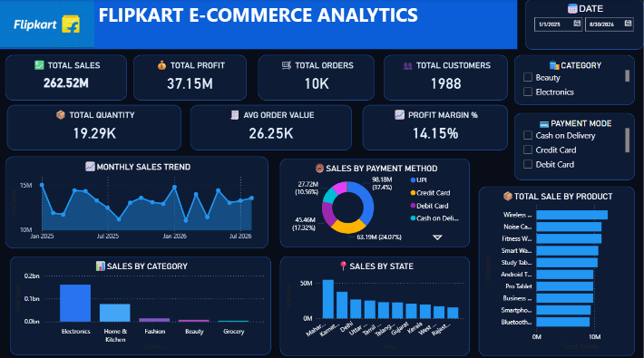

# Flipkart E-Commerce Analytics Dashboard

## 📊 Project Overview

An interactive **Flipkart E-Commerce Sales Analytics Dashboard** developed using **Microsoft Power BI** to analyze sales performance, profitability, customers, orders, products, payment methods, categories, and state-wise sales.

The dashboard transforms raw e-commerce data into meaningful business insights through interactive KPIs, slicers, charts, and analytical visuals.

## 🎯 Business Objectives

- Analyze overall sales and profit performance
- Track orders, customers, quantity, and average order value
- Identify top-performing products
- Analyze sales by category and payment method
- Compare sales performance across states
- Monitor monthly sales trends
- Provide an interactive dashboard for business reporting

## 🛠️ Tools & Technologies

- **Power BI**
- **Power Query**
- **DAX**
- **Data Modeling**
- **Data Cleaning & Transformation**
- **Interactive Slicers & Reports**

## 📌 Key KPIs

- Total Sales
- Total Profit
- Total Orders
- Total Customers
- Total Quantity
- Average Order Value
- Profit Margin %

## 📈 Dashboard Features

### Sales Analysis
- Monthly Sales Trend
- Sales by Category
- Sales by State
- Top 10 Products by Sales

### Payment Analysis
- Sales by Payment Method
- UPI
- Credit Card
- Debit Card
- Cash on Delivery
- Net Banking

### Interactive Filters
- Order Date
- Category
- Payment Mode

## 💡 Key Insights

The dashboard enables users to identify:

- Overall sales and profitability trends
- High-performing products and categories
- Customer and order performance
- Popular payment methods
- State-wise sales distribution
- Monthly changes in sales performance

## 📊 Dashboard Preview

## 📂 Project Contents

- `Flipkart-Ecommerce-Analytics.pbix` — Power BI dashboard file
- `README.md` — Project documentation
- `dashboard-preview.png` — Dashboard preview

## 👩‍💻 Author

**Rutuja Kusalkar**

**Fresher Data Analyst | SQL | Excel | Power BI | Python**

- GitHub: https://github.com/rutuj-ja
- LinkedIn: https://linkedin.com/in/rutujakusalkar

---

⭐ If you find this project useful, feel free to explore the repository.
